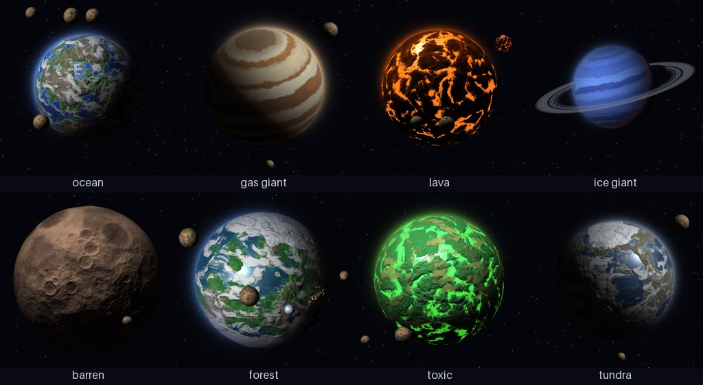

# Planet Generator

Procedural planet images from a single seed. Every planet comes with a JSON file describing it, and the same seed always gives the same planet, so you can come back to one later and render it bigger, turn it, or change its lighting.



What it draws:

- 12 planet types, from cratered rock and ice worlds to ocean planets with continents, lava worlds with glowing seas, and banded gas and ice giants with storms
- Terrain with continents, ridged mountain chains, impact craters and polar ice caps that grow or shrink with the planet's temperature
- Lighting from any direction, relief shading, glinting seas, a sunlit atmosphere with sunset colors along the day/night line, and a glowing rim when the sun is behind the planet
- Clouds that cast shadows, city lights on the night side of inhabited worlds
- Rings with fine ringlets and gaps that are lit by the sun, shaded by the planet and throw their own shadow onto it
- Moons in orbit, an axial tilt, and optional star or nebula backgrounds
- Animated spins (GIF or WebP) and overview sheets of a whole batch

## Install

Needs Python 3.9 or newer.

```bash
pip install -r requirements.txt
```

Or install it as a package, which adds the `planetgen` and `planetgen-gui` commands:

```bash
pip install .
```

## The designer window

```bash
python -m planetgen.gui
```

Pick a type, roll new planets, and drag the sliders to change the sun, tilt, clouds, colors and so on. The preview updates as you go. "Save image" writes the PNG and its JSON file at the export size you picked; "Save spinning animation" writes a GIF or WebP of one full turn.


## Command line

```bash
python planet_generator.py
```

This saves a random planet to `export/` as `<name>.png` and `<name>.json`. `python -m planetgen` and the `planetgen` command do the same. Some examples:

```bash
# A ringed gas giant on a starfield, 1024 pixels wide
planetgen --type gas_giant --rings --size 1024 --background stars

# The same planet every time
planetgen --seed 4242

# A thin crescent: sun behind and to the left
planetgen --seed 4242 --light 180 -40

# Twelve random planets plus one overview image of all of them
planetgen --count 12 --sheet --background stars

# An animation of the planet turning once, 48 frames
planetgen --seed 4242 --spin 48

# Re-render a saved planet larger, with a different tilt
planetgen --from export/Novaar-174.json --size 2048 --tilt 20
```

Options that describe the planet:

| Option | What it does |
| --- | --- |
| `-t, --type TYPE` | Planet type (see `--list-types`) |
| `-s, --seed SEED` | Seed for a reproducible planet |
| `-f, --from JSON` | Start from a planet's saved JSON file |
| `--rings`, `--no-rings` | Force rings on or off |
| `--light AZ EL` | Sun direction: azimuth counterclockwise from the right edge, elevation toward you (90 fully lit, 0 half lit, negative for a crescent) |
| `--tilt DEG` | Axial tilt, counterclockwise in the image |
| `--inclination DEG` | How far the north pole leans toward you (0 shows rings edge-on) |
| `--rotation DEG` | Turns the planet to show a different side |
| `--clouds COVER` | Cloud cover from 0 to 1 |
| `--atmosphere DENSITY` | Atmosphere thickness multiplier, 0 removes it |
| `--relief STRENGTH` | Terrain shading, 0 is flat |
| `--hue DEG` | Rotates the surface colors, try 120 or 180 for alien worlds |
| `--cities`, `--no-cities` | City lights on the night side |
| `--moons COUNT`, `--hide-moons` | Number of moons, or leave them out of the picture |

Options for the output:

| Option | What it does |
| --- | --- |
| `--size PX` | Image width and height (default 512) |
| `-b, --background` | `transparent` (default), `black`, `stars` or `nebula` |
| `-n, --count N` | Number of planets; with `--seed` they use consecutive seeds |
| `--sheet` | Also save `sheet.png` showing every planet of the run |
| `--spin [FRAMES]` | Also save an animation of one full turn (36 frames by default) |
| `--spin-format` | `gif` (default) or `webp`, which keeps transparency |
| `--fps N` | Animation speed (default 20) |
| `-o, --out DIR` | Output folder (default `export`) |
| `--open` | Open the result in your image viewer |
| `-q, --quiet` | Only print the saved file paths |

Anything you don't set is rolled from the seed. Changing one option keeps everything else the same, except that picking a different type re-rolls the temperature, clouds and physical stats to fit it.

## Planet types

| Type | Temperature (°C) | Look |
| --- | --- | --- |
| barren | 100 to 400 | Dusty rock covered in craters, no air |
| crystal | -50 to 100 | Glossy cyan crystal plains |
| desert | 40 to 60 | Sand and rock, a few craters, thin dust clouds |
| forest | 0 to 30 | Green continents and teal seas |
| gas_giant | -100 to 400 | Belts, zones and oval storms in six color schemes |
| ice | -200 to 0 | Frozen, cratered, slightly glossy |
| ice_giant | -220 to -150 | Soft cyan and blue bands |
| lava | 1000 to 2000 | Crust broken by glowing lava channels |
| ocean | 0 to 100 | Continents, mountains, seas and ice caps |
| toxic | 100 to 600 | Green crust with glowing acid seas |
| tundra | -60 to -5 | Cold brown lands with large ice caps |
| volcanic | 800 to 1500 | Dark crust, lava cracks and ash clouds |

## Metadata

Each image gets a JSON file next to it:

```json
{
    "seed": 3,
    "name": "Cosel Sigma-486",
    "type": "ocean",
    "temperature": 80,
    "rings": false,
    "moons": 4,
    "light_azimuth": 140.6,
    "light_elevation": 26.7,
    "tilt": -13.3,
    "clouds": 0.39,
    "radius_km": 8010,
    "density": 4.47,
    "day_length_hours": 46.5,
    "mass_earths": 1.611,
    "gravity_g": 1.02,
    "description": "An ocean world 16,020 km across with a thick atmosphere and 4 moons."
}
```

(Shortened; the real file lists every setting.) Pass it to `--from` to get the same planet back.

## Using it from Python

```python
from planetgen import PlanetSpec, render_planet

spec = PlanetSpec.random(seed=4242, type="ocean", clouds=0.2)
image = render_planet(spec, size=1024, background="stars")  # a PIL image
image.save("my_planet.png")
print(spec.description)
```

`render_planet_image(size, seed, planet_type, rings, background, **options)` does both steps and returns `(image, metadata)`, and `planetgen.render.render_spin(spec, size, frames)` returns the frames of a full turn.

## Project layout

```
planet_generator.py    command line entry point
planetgen/
    cli.py             command line options
    gui.py             designer window
    spec.py            PlanetSpec: everything rolled from a seed
    types.py           planet types, color ramps, gas giant palettes
    render.py          puts the layers together
    geometry.py        sphere and orientation math
    noise.py           Perlin and ridged noise in NumPy
    surface.py         terrain, craters, ice caps, gas giant bands, clouds
    lighting.py        sunlight, relief, atmosphere
    rings.py           ring structure, lighting and shadows
    moons.py           moon placement and rendering
    background.py      stars and nebulae
    output.py          saving images, animations and overview sheets
tests/                 pytest suite
```

Run the tests with:

```bash
pip install -r requirements-dev.txt
python -m pytest
```
